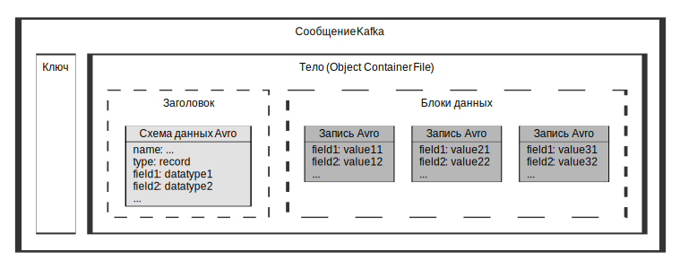

---
layout: default
title: Формат выгрузки данных
nav_order: 5
parent: Справочная информация
has_children: false
has_toc: false
---

# Формат выгрузки данных {#download_format}
{: .no_toc }

<details markdown="block">
  <summary>
    Содержание раздела
  </summary>
  {: .text-delta }
1. TOC
{:toc}
</details>

## Структура сообщений {#message_structure}

Данные выгружаются из системы в виде сообщений топиков Kafka. Каждое сообщение имеет структуру, показанную
на рисунке ниже.


{: .figure-center}
*Структура выгружаемых сообщений*
{: .figure-caption-center}

## Формат данных {#data_format}

Данные выгружаются из системы в следующем формате:
*   Выгрузка данных выполняется в топик Kafka, указанный в настройках внешней таблицы выгрузки.
*   Каждое сообщение топика Kafka состоит из ключа и тела.
*   Тело сообщения представляет собой файл Avro ([Object Container File](https://avro.apache.org/docs/1.10.2/spec.html#Object+Container+Files)), 
    который состоит из заголовка и блоков данных.
*   Заголовок файла содержит схему данных Avro.
*   Схема данных тела сообщения содержит следующие элементы: имя, тип “record” и перечень полей. 
    Для каждого поля указано имя, а также тип данных из числа перечисленных в разделе 
    [Выгружаемые типы данных](../supported_data_types/download_data_types/download_data_types.md) 
    (см. пример [ниже](#avro_schema_example)).
*   Каждый блок данных содержит запись, представленную в бинарной кодировке. Запись соответствует схеме данных из заголовка файла Avro.
*   Каждая запись содержит перечень полей и их значений. Имена и порядок перечисления полей, а также типы данных их значений
    соответствуют схеме данных (см. пример [ниже](#avro_record_example)).
*   Состав и порядок полей совпадают в следующих объектах:
    *   во внешней таблице выгрузки,
    *   в схеме данных тела сообщения,
    *   в наборе выгружаемых записей.
	
Типы данных Avro, доступные к выгрузке из системы, описаны в разделе [Выгружаемые типы данных](../supported_data_types/download_data_types/download_data_types.md). 
Подробнее о формате Avro см. в официальной документации на сайте [https://avro.apache.org](https://avro.apache.org/).

## Примеры {#examples}

### Пример выгружаемой схемы данных Avro {#avro_schema_example}

Пример ниже содержит схему данных Avro, выгружаемую с данными о продажах из СУБД ADB. Для наглядности 
примера бинарные данные представлены в **JSON-формате**.
```json
{
  "name": "row",
  "type": "record",
  "fields": [
    {
      "name": "id",
      "type": "long"
    },
    {
      "name": "transaction_date",
      "type": "long"
    },
    {
      "name": "product_code",
      "type": "string"
    },
    {
      "name": "product_units",
      "type": "long"
    },
    {
      "name": "store_id",
      "type": "long"
    },
    {
      "name": "description",
      "type": "string"
    }
  ]
}
```

### Пример выгружаемых записей Avro {#avro_record_example}

В примере ниже показан набор записей Avro о продажах, выгруженных из СУБД ADB и соответствующих схеме 
из предыдущего примера. Для наглядности примера бинарные данные представлены в **JSON-формате**.
```json
[
  {
    "id": 1000111,
    "transaction_date": 1614269474000000,
    "product_code": "ABC102101",
    "product_units": 2,
    "store_id": 1000012345,
    "description": "Покупка по акции 1+1"
  },
  {
    "id": 1000112,
    "transaction_date": 1614334214000000,
    "product_code": "ABC102001",
    "product_units": 1,
    "store_id": 1000000123,
    "description": "Покупка без акций"
  }
]
```