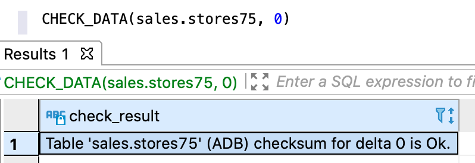
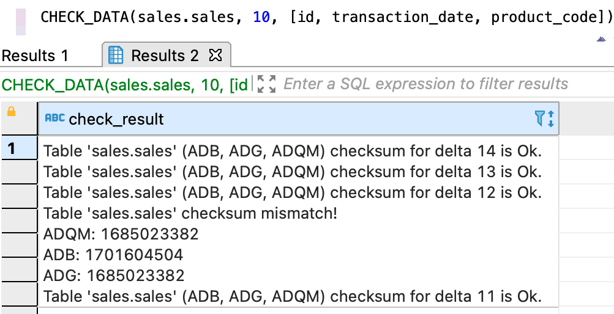

---
layout: default
title: CHECK_DATA
nav_order: 3
parent: Запросы SQL+
grand_parent: Справочная информация
has_children: false
has_toc: false
---

# CHECK_DATA
{: .no_toc }

<details markdown="block">
  <summary>
    Содержание раздела
  </summary>
  {: .text-delta }
1. TOC
{:toc}
</details>

Запрос позволяет проверить идентичность данных [логической таблицы](../../../overview/main_concepts/logical_table/logical_table.md)
во всех [СУБД](../../../introduction/supported_DBMS/supported_DBMS.md)
[хранилища](../../../overview/main_concepts/data_storage/data_storage.md). Данные проверяются по 
[дельтам](../../../overview/main_concepts/delta/delta.md) в обратном порядке: с последней закрытой дельты до 
указанной в запросе (обе дельты включительно). При первом найденном расхождении система останавливает проверку 
и возвращает сообщение о расхождении в данных.

В проверке участвуют все СУБД хранилища, в которых есть данные логической таблицы, указанной в запросе.
Если такая СУБД одна, проверка все равно проходит и считается успешной.

Порядок проверки зависит от параметров запроса:
* если указаны столбцы к проверке, система сверяет контрольные суммы загруженных записей в каждой дельте;
* иначе — система сверяет количество загруженных записей в каждой дельте.

Подробнее о порядке проверки см. в секции [Порядок проверки данных](#check_order), 
о расчете контрольной суммы — в секции [Порядок расчета контрольной суммы](#checksum).

В ответе возвращается:
*   объект ResultSet с одной записью, содержащей результат проверки, при успешном выполнении запроса. Результат
    включает список проверенных дельт, где для каждой указано сообщение об успешной проверке или
    найденном расхождении;
*   исключение при неуспешном выполнении запроса.

Проверка может давать ложноположительный результат. Этому подвержены оба варианта проверок: как с указанием, так и без 
указания столбцов. Чтобы снизить частоту ложных срабатываний, рекомендуется включать первичный ключ в список проверяемых 
столбцов.
{: .tip-wrapper}

## Синтаксис {#syntax}

```sql
CHECK_DATA([db_name.]table_name, delta_number[, normalization][, square-bracketed_column_list])
```

Параметры:
*   `db_name` (опциональный) — имя логической базы данных, в которой находится проверяемая логическая таблица. Параметр 
    опционален, если выбрана логическая БД, [используемая по умолчанию](../../../working_with_system/other_features/default_db_set-up/default_db_set-up.md);
*   `table_name` — имя проверяемой логической таблицы;
*   `delta_number` — номер дельты, с которой начинается проверка. Должен быть меньше или равен номеру 
    последней закрытой дельты. Номер последней закрытой дельты можно узнать с помощью запроса 
    [GET_DELTA_OK](../../../reference/sql_plus_requests/GET_DELTA_OK/GET_DELTA_OK.md);
*   `normalization` (опциональный) — коэффициент, который повышает максимально допустимое количество записей в 
    дельте, но снижает уникальность контрольных сумм. Может принимать любое положительное целочисленное значение, 
    начиная с 1. Значение по умолчанию — 1. Если коэффициент не указан или равен 1, каждая из проверяемых дельт может
    содержать до `4'294'967'298` записей; при увеличении коэффициента допустимое количество записей
    увеличивается пропорционально. Если количество записей в какой-либо из дельт больше допустимого, в ответе
    возвращается исключение;
*   `square_bracketed_column_list` (опциональный) — список проверяемых столбцов таблицы. Элементы списка должны быть 
    указаны в квадратных скобках через запятую, например `[identification_number, transaction_date]`. 
    Если столбцы указаны, проверяется контрольная сумма загруженных записей в каждой дельте, иначе — 
    количество таких записей.
    
## Ограничения {#restrictions}

*   Существует математическая вероятность получения одинаковых контрольных сумм для разных наборов записей, поэтому 
    возможен ложноположительный результат проверки.
*   Максимальное количество записей в дельте, для которых контрольная сумма рассчитывается корректно, 
    пропорционально коэффициенту нормализации. Если коэффициент не указан или равен 1, проверяемая дельта может 
    содержать до `4'294'967'298` записей; при увеличении коэффициента допустимое количество записей также увеличивается.

## Примеры {#examples}

### Запрос без перечисления столбцов {#example_without_columns}

Проверка целостности данных логической таблицы `stores75` в диапазоне \[дельта 0, последняя закрытая дельта\]:
```sql
CHECK_DATA(sales.stores75, 0)
```

На рисунке ниже показан пример ответа `CHECK_DATA` при успешной проверке логической таблицы `stores75`, 
данные которой размещены только в ADB.

<a id="img_check_for_one_db"></a>
{:height="50%" width="50%"}
{: .figure-center}
*Ответ CHECK_DATA с проверкой только в ADB*
{: .figure-caption-center}

### Запрос с перечислением столбцов {#example_with_columns}

Проверка целостности данных столбцов `identification_number`, `transaction_date` и `product_code` таблицы `sales`:
```sql
CHECK_DATA(sales.sales, 10, [identification_number, transaction_date, product_code])
```

На рисунке ниже показан пример ответа на запрос `CHECK_DATA` по столбцам таблицы при наличии расхождений: 
контрольная сумма дельты 10 в ADB отличается от контрольной суммы в ADG и ADQM.

{:height="80%" width="80%"}
{: .figure-center}
*Ответ CHECK_DATA с найденными расхождениями*
{: .figure-caption-center}

### Запрос с коэффициентом нормализации {#example_with_normalization}

Проверка целостности данных некоторых столбцов таблицы `sales` с коэффициентом нормализации 100:
```sql
CHECK_DATA(sales.sales, 12, 100, [identification_number, transaction_date, product_code])
```

На рисунке ниже показан пример ответа на такой запрос.

{:height="80%" width="80%"}
{: .figure-center}
*Запрос CHECK_DATA с коэффициентом нормализации*
{: .figure-caption-center}

## Порядок проверки данных {#check_order}

Идентичность данных проверяется в следующем порядке:
1. В каждой из целевых СУБД:
    1. Выбираются проверяемые дельты: от указанной в запросе до последней закрытой (обе включительно).
    2. По каждой дельте выбираются все записи, загруженные в логическую таблицу, которая указана
       в запросе.
    3. По каждой дельте — в зависимости от наличия/отсутствия столбцов в запросе — рассчитывается 
       контрольная сумма или количество загруженных записей. Порядок расчета контрольной суммы см. [ниже](#checksum).
2. Значения по каждой дельте сравниваются в целевых СУБД.
3. Если значение по одной из дельт отсутствует или не соответствует другим, для нее в ответе возвращается сообщение о 
   расхождении в данных. Иначе по всем дельтам возвращаются сообщения об успешной проверке.
   
## Порядок расчета контрольной суммы {#checksum}

Контрольная сумма логической таблицы в дельте рассчитывается в следующем порядке:
1. По каждой записи, загруженной в логическую таблицу в этой дельте:
   1. Формируется текстовая строка: значения столбцов конвертируются в зависимости от типа данных 
      (см. таблицу [ниже](#tab_date_type_conversion)) и записываются через точку с запятой. Значение NULL 
      записывается как пустая строка.
   2. Для полученной строки вычисляется MD5-хеш в виде байтовой последовательности в шестнадцатеричном формате.
   3. Хеш интерпретируется как ASCII-строка в нижнем регистре.
   4. Выбираются первые 4 символа строки, выстраиваются в порядке от младшего к старшему (little endian) и 
      конвертируются в целое 32-битное число.
   5. Полученное число делится на коэффициент нормализации, дробная часть результата отбрасывается — 
      получается контрольная сумма записи.
2. Контрольные суммы всех записей в дельте суммируются — получается 64-битная контрольная сумма таблицы в дельте.

В таблице ниже показано, как значения столбцов (`column_value`), указанных в запросе, конвертируются 
в зависимости от их типа данных.
<a id="tab_date_type_conversion"></a>

| Тип данных | Порядок конвертации | Пример
|:-|:-|:-
| BOOLEAN | (column_value)::int | true -> 1
| DATE | column_value - make_date(1970, 01, 01) | 2021-03-15 -> 18701
| TIME | (extract(epoch from column_value)*1000000)::bigint | 13:01:44 -> 46904000000
| TIMESTAMP | (extract(epoch from column_value)*1000000)::bigint  | 2020-11-17 21:11:12 -> 1605647472000000
| Другие типы данных | column_value | Иванов -> Иванов

### Пример расчета контрольной суммы {#checksum_example}

Рассмотрим пример расчета контрольной суммы таблицы `sales` в дельте, в которой была загружена одна 
запись со следующими значениями:
* `identification_number` = 10021, 
* `transaction_date` = 2020-11-17 21:11:12, 
* `product_code` = ABC1830.

В качестве коэффициента нормализации возьмем число 10.

Контрольная сумма таблицы рассчитывается в следующем порядке:
1. Формируется строка для хеш-функции: `10021;1605647472000000;ABC1830`.
2. Вычисляется MD5-хеш: `bedbead6aea8ca373d8f0a15713639c1`.
3. Выбираются первые 4 символа хеша: `bedb`.
4. Символы интерпретируются как ASCII-строка в нижнем регистре: `98 101 100 98`.
5. Строка конвертируется в целое 32-битное число: 98\*2<sup>0</sup> + 101\*2<sup>8</sup> + 100\*2<sup>16</sup> + 
   98\*2<sup>24</sup> = 1650746722.
6. Полученное значение делится на коэффициент нормализации, остаток отбрасывается: 1650746722 : 10 = 165074672.

Так как запись в дельте одна, контрольная сумма таблицы в этой дельте равна полученной контрольной сумме 
записи (`165074672`).