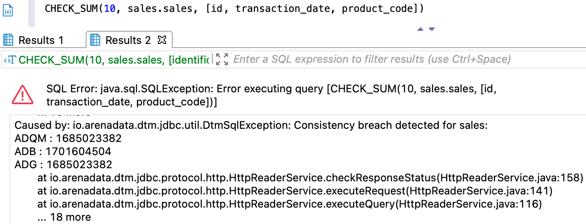
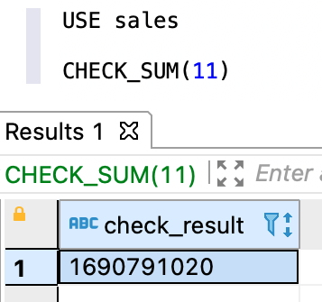

---
layout: default
title: CHECK_SUM
nav_order: 5
parent: Запросы SQL+
grand_parent: Справочная информация
has_children: false
has_toc: false
---

# CHECK_SUM
{: .no_toc }

<details markdown="block">
  <summary>
    Содержание раздела
  </summary>
  {: .text-delta }
1. TOC
{:toc}
</details>

Запрос позволяет рассчитать контрольную сумму данных в указанной [дельте](../../../overview/main_concepts/delta/delta.md).
Дельта может быть любой: как закрытой, так и открытой (горячей).

Расчет контрольной суммы возможен по следующим данным:
*   отдельным столбцам [логической таблицы](../../../overview/main_concepts/logical_table/logical_table.md) или 
    [материализованного представления](../../../overview/main_concepts/materialized_view/materialized_view.md),
*   всем столбцам логической таблицы или материализованного представления,
*   всем логическим таблицам [логической базы данных](../../../overview/main_concepts/logical_db/logical_db.md).

Контрольная сумма рассчитывается по каждой [СУБД](../../../introduction/supported_DBMS/supported_DBMS.md) 
[хранилища](../../../overview/main_concepts/data_storage/data_storage.md), 
в которой есть данные проверяемой логической сущности. Расчет выполняется в порядке, описанном 
[ниже](#checksum_algorithms). Если контрольные суммы хотя бы одной логической сущности 
различаются между СУБД хранилища, в ответе возвращается исключение `Consistency breach detected for <entity_name>` 
с перечислением контрольных сумм во всех проверенных СУБД.

В ответе возвращается:
*   объект ResultSet с одной записью, содержащей контрольную сумму данных, при успешном выполнении запроса 
    и отсутствии расхождений между СУБД хранилища;
*   исключение при наличии расхождений или неуспешном выполнении запроса.

## Синтаксис {#syntax}

```sql
CHECK_SUM(delta_num[, normalization][, [db_name.]entity_name[, square-bracketed_column_list]])
```

Параметры:
*   `delta_num` — номер открытой (горячей) или закрытой [дельты](../../../overview/main_concepts/delta/delta.md), 
    в которой рассчитывается контрольная сумма таблицы, представления или логической БД. Если других аргументов 
    в запросе нет, контрольная сумма рассчитывается по всем логическим таблицам логической БД;
*   `normalization` (опциональный) — коэффициент, который повышает максимально допустимое количество записей 
    таблицы (или представления) в дельте, но снижает уникальность контрольных сумм. 
    Может принимать любое положительное целочисленное значение, начиная с 1. Значение по умолчанию — 1. 
    Если коэффициент не указан или равен 1, проверяемая таблица (представление) может содержать в дельте 
    до `4'294'967'298` записей; при увеличении коэффициента допустимое количество записей
    увеличивается пропорционально. Если количество записей какой-либо таблицы (или представления) в дельте 
    больше допустимого, в ответе возвращается исключение;
*   `entity_name` (опциональный) — имя логической таблицы или материализованного представления, по которым 
    рассчитывается контрольная сумма;
*   `square-bracketed_column_list` (опциональный) — список имен столбцов указанной таблицы или представления, 
    по которым рассчитывается контрольная сумма. Элементы списка перечисляются внутри квадратных 
    скобок через запятую. Если список столбцов не указан, контрольная сумма рассчитывается по всем столбцам 
    логической таблицы или материализованного представления.
    
## Ограничения {#restrictions}

*   Контрольная сумма логической базы данных рассчитывается только по данным логических таблиц и не учитывает данные 
    материализованных представлений.
*   Существует математическая вероятность получения одинаковых контрольных сумм для разных наборов данных.
*   Максимально допустимое количество записей таблицы (или представления) в дельте, для которых контрольная 
    сумма рассчитывается корректно, пропорционально коэффициенту нормализации. Если коэффициент не указан или равен 1,
    каждая из проверяемых таблиц или представлений может содержать до `4'294'967'298` записей в дельте; 
    при увеличении коэффициента допустимое количество записей также увеличивается.

## Примеры {#examples}

### Запрос по некоторым столбцам логической таблицы {#columns_example}

Расчет контрольной суммы по трем столбцам таблицы `sales` в десятой дельте:
```sql
CHECK_SUM(10,sales.sales,[identification_number, transaction_date, product_code])
```

На рисунках ниже показаны примеры ответов на запрос `CHECK_SUM` с перечислением столбцов: 
на первом — ответ при отсутствии расхождений в данных между СУБД хранилища, на втором — ответ при 
наличии расхождений.


{: .figure-center}
*Ответ CHECK_SUM по указанным столбцам таблицы при отсутствии расхождений*
{: .figure-caption-center}


{: .figure-center}
*Ответ CHECK_SUM при наличии расхождений*
{: .figure-caption-center}

### Запрос по всем столбцам логической таблицы {#table_example}

Расчет контрольной суммы по всей таблице `sales` в десятой дельте:
```sql
CHECK_SUM(10,sales.sales)
```

На рисунке ниже показан пример ответа на запрос `CHECK_SUM` по логической таблице.

{:height="40%" width="40%"}
{: .figure-center}
*Ответ CHECK_SUM по логической таблице*
{: .figure-caption-center}

### Запрос по всем столбцам материализованного представления {#matview_example}

Расчет контрольной суммы по всему материализованному представлению `sales_by_stores` в десятой дельте:
```sql
CHECK_SUM(10,sales.sales_by_stores)
```

### Запрос по логической базе данных {#db_example}

Расчет контрольной суммы по всей логической базе данных `sales` в десятой дельте:
```sql
USE sales
CHECK_SUM(10)
```

На рисунке ниже показан пример ответа на запрос `CHECK_SUM` по логической базе данных.

{:height="40%" width="40%"}
{: .figure-center}
*Ответ CHECK_SUM по логической базе данных*
{: .figure-caption-center}

### Запрос по логической базе данных с коэффициентом нормализации {#example_with_normalization}

Расчет контрольной суммы по логической базе данных `sales` с коэффициентом нормализации, равным 100:
```sql
USE sales
CHECK_SUM(7, 100)
```

На рисунке ниже показан пример ответа на такой запрос.

{:height="40%" width="40%"}
{: .figure-center}
*Запрос CHECK_SUM с коэффициентом нормализации*
{: .figure-caption-center}

## Порядок расчета контрольных сумм {#checksum_algorithms}

### Расчет контрольной суммы по логической таблице (материализованному представлению) {#algorithm_for_table}

Контрольная сумма логической таблицы или материализованного представления рассчитывается, 
[как описано в разделе CHECK_DATA](../CHECK_DATA/CHECK_DATA.md#checksum).

### Расчет контрольной суммы по логической базе данных {#algorithm_for_db}

Контрольная сумма логической базы данных рассчитывается в следующем порядке:
1. По каждой логической таблице логической БД рассчитывается контрольная сумма, 
   [как описано в разделе CHECK_DATA](../CHECK_DATA/CHECK_DATA.md#checksum).
2. Контрольные суммы всех логических таблиц суммируются — получается 64-битная контрольная сумма 
   логической базы данных.

### Пример расчета контрольной суммы по таблице {#example_for_table}

Рассмотрим пример расчета контрольной суммы по таблице `sales` в дельте, содержащей две 
операции записи. Для простоты примера по каждой из записей возьмем заранее рассчитанную 32-битную контрольную 
сумму: 165074672 (см. [пример расчета](../CHECK_DATA/CHECK_DATA.md#checksum_example) 
в разделе [CHECK_DATA](../CHECK_DATA/CHECK_DATA.md)) и 87891666.

Контрольная сумма таблицы равна `165074672 + 87891666 = 252966338`.