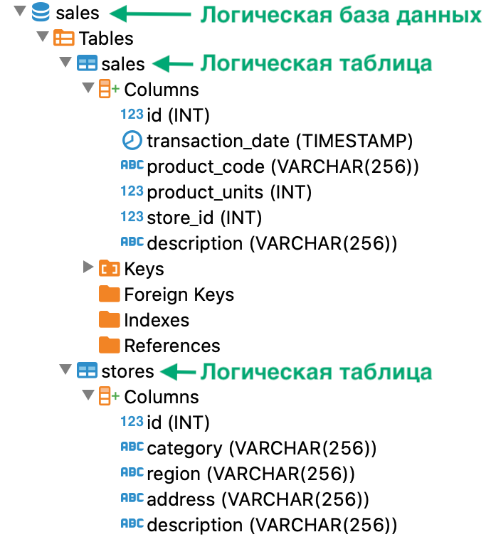
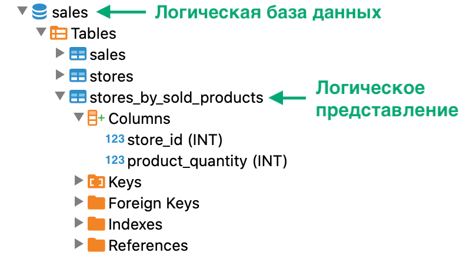
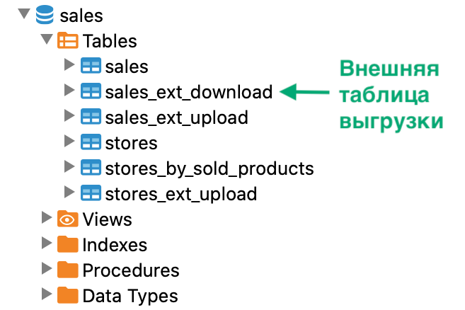

---
layout: default
title: Проверка наличия логической сущности
nav_order: 14
parent: Управление схемой данных
grand_parent: Работа с системой
has_children: false
---

# Проверка наличия логической сущности {#entity_presence_check}
{: .no_toc }

<details markdown="block">
  <summary>
    Содержание раздела
  </summary>
  {: .text-delta }
1. TOC
{:toc}
</details>

При успешном создании любой логической сущности — [логической базы данных](../../../overview/main_concepts/logical_db/logical_db.md), 
[логической таблицы](../../../overview/main_concepts/logical_table/logical_table.md), 
[логического представления](../../../overview/main_concepts/logical_view/logical_view.md),
[внешней таблицы](../../../overview/main_concepts/external_table/external_table.md) 
загрузки, внешней таблицы выгрузки или [материализованного представления](../../../overview/main_concepts/materialized_view/materialized_view.md) 
— система возвращает в ответе пустой объект ResultSet. Если сущность не удалось 
создать, система возвращает исключение. Таким образом, по ответу на запрос 
можно определить, создалась ли логическая сущность, но при необходимости можно проверить наличие сущности, 
как описано в этом разделе.

Наличие логической сущности можно проверить любым из способов:
* [запросить метаданные](../request_from_schema/request_from_schema.md) из 
  соответствующего [системного представления](../../../reference/system_views/system_views.md) 
  (способ недоступен для внешних таблиц);
* выполнить [SELECT](../../../reference/sql_plus_requests/SELECT/SELECT.md)-запрос к проверяемой 
  логической сущности (способ недоступен для логической БД и внешних таблиц);
* проверить дерево объектов в SQL-клиенте.

Примеры запросов для каждого типа сущности доступны в секциях ниже:
* [Проверка наличия логической базы данных](#db_check);
* [Проверка наличия логической таблицы](#table_check);
* [Проверка наличия логического представления](#view_check);
* [Проверка наличия материализованного представления](#mat_view_check);
* [Проверка наличия внешней таблицы](#ext_table_check).

**Примечание:** наличие внешних таблиц загрузки и выгрузки можно проверить только в дереве объектов 
SQL-клиента. Внешние таблицы не отображаются в системных представлениях, и для них недоступны SELECT-запросы.

## Проверка наличия логической базы данных {#db_check}

Чтобы проверить наличие логической базы данных, используйте любой из способов:
*   Выполните запрос к системному представлению `schemata` (вместо `DB_NAME` подставьте имя логической БД в 
    верхнем регистре):
    ``` sql
    SELECT
      CASE
        WHEN count(*) > 0 THEN 'БД существует'
        ELSE 'БД не существует'
      END
    FROM INFORMATION_SCHEMA.schemata
    WHERE schema_name = '<DB_NAME>'
    ```
    Если логическая база данных существует, в ответе возвращается строка "БД существует", иначе — строка 
    "БД не существует".
*   Проверьте дерево объектов в вашем SQL-клиенте (см. рисунок [ниже](#img_table_in_tree)).
    <br>Если логическая база данных существует, она присутствует среди объектов в SQL-клиенте,
    иначе — отсутствует среди объектов.

На рисунке ниже показана логическая БД в дереве объектов SQL-клиента.

<a id="img_table_in_tree"></a>
{:height="50%" width="50%"}
{: .figure-center}
*Логическая БД в дереве объектов*
{: .figure-caption-center}

## Проверка наличия логической таблицы {#table_check}

Чтобы проверить наличие логической таблицы, используйте любой из способов:
*   Выполните запрос к системному представлению `tables` (вместо `DB_NAME` и `TABLE_NAME` подставьте имя логической БД и имя
    таблицы в верхнем регистре):
    ```sql
    SELECT
      CASE
        WHEN count(*) > 0 THEN 'таблица существует'
        ELSE 'таблица не существует'
      END
    FROM INFORMATION_SCHEMA.tables
    WHERE table_schema = '<DB_NAME>' AND (table_name = '<TABLE_NAME>' AND table_type = 'BASE TABLE')
    ```
    Если логическая таблица существует, в ответе возвращается строка "таблица существует", иначе — строка
    "таблица не существует".
*   Выполните [SELECT](../../../reference/sql_plus_requests/SELECT/SELECT.md)-запрос к логической
    таблице, например:
    ```sql
    SELECT * FROM <db_name>.<table_name> LIMIT 5
    ```
    Если логическая таблица существует, запрос возвращает от ноля до пяти записей (в зависимости от содержимого
    таблицы), иначе — исключение `Entity <table_name> does not exist`.
*   Проверьте дерево объектов в вашем SQL-клиенте (см. рисунок [ниже](#img_table_in_object_tree)).
    <br>Если логическая таблица существует, она присутствует среди объектов логической БД в SQL-клиенте,
    иначе — отсутствует среди таких объектов.

    <a id="img_table_in_object_tree"></a>
    {:height="40%" width="40%"}
    {: .figure-center}
    *Логические таблицы в дереве объектов*
    {: .figure-caption-center}

## Проверка наличия логического представления {#view_check}

Чтобы проверить наличие логического представления, используйте любой из способов:
*   Выполните запрос к системному представлению `tables` (вместо `DB_NAME` и `VIEW_NAME` подставьте имя логической БД и имя
    логического представления в верхнем регистре):
    ```sql
    SELECT
      CASE
        WHEN count(*) > 0 THEN 'представление существует'
        ELSE 'представление не существует'
      END
    FROM INFORMATION_SCHEMA.tables
    WHERE table_schema = '<DB_NAME>' AND (table_name = '<VIEW_NAME>' AND table_type = 'VIEW')
    ```
    Если логическое представление существует, в ответе возвращается строка "представление существует", 
    иначе — строка "представление не существует".
*   Выполните [SELECT](../../../reference/sql_plus_requests/SELECT/SELECT.md)-запрос
    к логическому представлению, например:
    ```sql
    SELECT * FROM <db_name>.<view_name> LIMIT 5
    ```
    Если логическое представление существует, запрос возвращает от ноля до пяти записей, иначе — 
    исключение `Entity <view_name> does not exist`.
*   Проверьте дерево объектов в вашем SQL-клиенте (см. рисунок [ниже](#img_view_in_object_tree)).
    <br>Если логическое представление, оно присутствует среди объектов логической БД в SQL-клиенте,
    иначе — отсутствует среди объектов логической БД.

    <a id="img_view_in_object_tree"></a>
    {:height="50%" width="50%"}
    {: .figure-center}
    *Логическое представление в дереве объектов*
    {: .figure-caption-center}

## Проверка наличия материализованного представления {#mat_view_check}

Чтобы проверить наличие материализованного представления, используйте любой из способов:
*   Выполните запрос к системному представлению `tables` (вместо `DB_NAME` и `MATERIALIZED_VIEW_NAME` подставьте 
    имя логической БД и имя представления в верхнем регистре):
    ```sql
    SELECT
      CASE
        WHEN count(*) > 1 THEN 'представление существует'
        ELSE 'представление не существует'
      END
    FROM INFORMATION_SCHEMA.tables
    WHERE table_schema = '<DB_NAME>' AND
      ((table_name = '<MATERIALIZED_VIEW_NAME>' AND table_type = 'BASE TABLE') OR
      (table_name = 'SYS_<MATERIALIZED_VIEW_NAME>' AND table_type = 'VIEW'))
    ```
    Если материализованное представление существует, в ответе возвращается строка "представление существует",
    иначе — строка "представление не существует".
*   Выполните [SELECT](../../../reference/sql_plus_requests/SELECT/SELECT.md)-запрос к материализованному
    представлению, например:
    ```sql
    SELECT * FROM <db_name>.<materialized_view_name> LIMIT 5
    ```
    Если материализованное представление существует, запрос возвращает от ноля до пяти записей, иначе — 
    исключение `Entity <materialized_view_name> does not exist`.
*   Проверьте дерево объектов в вашем SQL-клиенте (см. рисунок [ниже](#img_mat_view_in_object_tree)).
    <br>Если материализованное представление существует, оно присутствует среди объектов логической БД в SQL-клиенте,
    иначе — отсутствует среди объектов логической БД.

    <a id="img_mat_view_in_object_tree"></a>
    {:height="70%" width="70%"}
    {: .figure-center}
    *Материализованное представление в дереве объектов*
    {: .figure-caption-center}

## Проверка наличия внешней таблицы {#ext_table_check}

Чтобы проверить наличие внешней таблицы загрузки или выгрузки, проверьте дерево объектов в вашем SQL-клиенте 
(см. рисунки [ниже](#img_upload_table_in_tree)). Если внешняя таблица существует, она присутствует среди 
объектов логической БД в SQL-клиенте, иначе — отсутствует среди объектов логической БД.

На рисунках ниже показаны фрагменты дерева объектов SQL-клиента: с внешней таблицей загрузки `sales_ext_upload` 
и внешней таблицей выгрузки `sales_ext_download` соответственно.

<a id="img_upload_table_in_tree"></a>
{:height="50%" width="50%"}
{: .figure-center}
*Внешняя таблица загрузки в дереве объектов*
{: .figure-caption-center}

<a id="img_download_table_in_tree"></a>
{:height="50%" width="50%"}
{: .figure-center}
*Внешняя таблица выгрузки в дереве объектов*
{: .figure-caption-center}