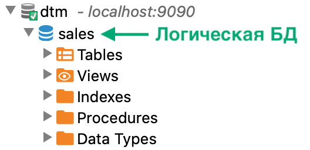
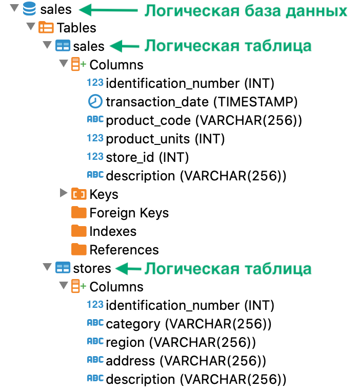

---
layout: default
title: Проверка наличия логической сущности
nav_order: 14
parent: Управление схемой данных
grand_parent: Работа с системой
has_children: false
---

# Проверка наличия логической сущности

При успешном создании любой сущности — [логической базы данных](../../../Обзор_понятий_компонентов_и_связей/Основные_понятия/Логическая_база_данных/Логическая_база_данных.md), 
[логической таблицы](../../../Обзор_понятий_компонентов_и_связей/Основные_понятия/Логическая_таблица/Логическая_таблица.md), 
[логического представления](../../../Обзор_понятий_компонентов_и_связей/Основные_понятия/Логическое_представление/Логическое_представление.md),
[внешней таблицы](../../../Обзор_понятий_компонентов_и_связей/Основные_понятия/Внешняя_таблица/Внешняя_таблица.md) 
загрузки, внешней таблицы выгрузки или [материализованного представления](../../../Обзор_понятий_компонентов_и_связей/Основные_понятия/Материализованное_представление/Материализованное_представление.md) 
— система возвращает пустой объект ResultSet в ответе на соответствующий запрос. Если сущность не удалось 
создать из-за ошибки, система возвращает исключение в ответе. Таким образом, по результатам выполнения запроса 
можно определить, создалась ли нужная сущность. Однако при необходимости можно проверить ее наличие, 
как описано в этом разделе.

Проверить наличие логической сущности можно несколькими способами:
* [запросить метаданные логической схемы данных](../Запрос_метаданных_логической_схемы/Запрос_метаданных_логической_схемы.md), 
  выполнив запрос к соответствующему [системному представлению](../../../Справочная_информация/Системные_представления_INFORMATION_SCHEMA/Системные_представления_INFORMATION_SCHEMA.md);
* выполнить [SELECT](../../../Справочная_информация/Запросы_SQLplus/SELECT/SELECT.md)-запрос к 
  логической сущности (способ недоступен для логической БД);
* проверить дерево объектов в SQL-клиенте.

Примеры запросов для каждой из сущностей приведены в секциях ниже:
* [Проверка наличия логической базы данных](#проверка-наличия-логической-базы-данных);
* [Проверка наличия логической таблицы](#проверка-наличия-логической-таблицы);
* [Проверка наличия логического представления](#проверка-наличия-логического-представления);
* [Проверка наличия материализованного представления](#проверка-наличия-материализованного-представления).

**Примечание:** внешние таблицы задают формат загрузки/выгрузки данных и не являются логическими 
сущностями в полном смысле. Их наличие невозможно проверить напрямую: они не отображаются в логической схеме 
данных и дереве объектов, и для них недоступны SELECT-запросы. Однако, если при попытке создания 
внешней таблицы система обнаружит, что сущность с таким именем уже есть, то вернет в ответе исключение вида 
`Entity <entity_name> already exists`.

## Проверка наличия логической базы данных

Чтобы проверить наличие логической базы данных, используйте любой из способов:
*   Выполните запрос к системному представлению `schemata` (вместо `DB_NAME` подставьте имя логической БД в 
    верхнем регистре; см. пример [ниже](#ex_db)):
    ```sql
    SELECT * FROM INFORMATION_SCHEMA.schemata
    WHERE schema_name = '<DB_NAME>'
    ```
    Если логическая база данных существует, запрос возвращает одну запись, иначе — ноль записей.
*   Проверьте дерево объектов в вашем SQL-клиенте (см. рисунок [ниже](#img_table_in_tree)).
    <br>Если логическая база данных существует, она присутствует среди объектов в SQL-клиенте,
    иначе — отсутствует среди объектов.

В примере ниже показан запрос для проверки наличия логической БД `sales`.

<a id="ex_db"></a>
``` sql
-- проверка наличия логической базы данных sales
SELECT
  CASE
    WHEN count(*) > 0 THEN 'БД существует'
    ELSE 'БД не существует'
  END
FROM INFORMATION_SCHEMA.schemata
WHERE schema_name = 'SALES'
```

На рисунке ниже показана логическая БД в дереве объектов SQL-клиента.

<a id="img_table_in_tree"></a>
{:height="50%" width="50%"}
{: .figure-center}
*Логическая БД в дереве объектов*
{: .figure-caption-center}

## Проверка наличия логической таблицы

Чтобы проверить наличие логической таблицы, используйте любой из способов:
*   Выполните запрос к системному представлению `tables` (вместо `DB_NAME` и `TABLE_NAME` подставьте имя логической БД и имя
    таблицы в верхнем регистре; см. пример [ниже](#ex_table)):
    ```sql
    SELECT * FROM INFORMATION_SCHEMA.tables
    WHERE table_schema = '<DB_NAME>' AND (table_name = '<TABLE_NAME>' AND table_type = 'BASE TABLE')
    ```
    Если логическая таблица существует, запрос возвращает одну запись, иначе — ноль записей.
*   Выполните [SELECT](../../../Справочная_информация/Запросы_SQLplus/SELECT/SELECT.md)-запрос к логической
    таблице, например:
    ```sql
    SELECT * FROM <db_name>.<table_name> LIMIT 5
    ```
    Если логическая таблица существует, запрос возвращает от ноля до пяти записей (в зависимости от содержимого
    таблицы), иначе — исключение `Entity <table_name> does not exist`.
*   Проверьте дерево объектов в вашем SQL-клиенте (см. рисунок [ниже](#img_table_in_object_tree)).
    <br>Если логическая таблица существует, она присутствует среди объектов логической БД в SQL-клиенте,
    иначе — отсутствует среди объектов логической БД.
    
В примере ниже показан запрос для проверки наличия логической таблицы `sales`.

<a id="ex_table"></a>
```sql
-- проверка наличия логической таблицы sales
SELECT
  CASE
    WHEN count(*) > 0 THEN 'таблица существует'
    ELSE 'таблица не существует'
  END
FROM INFORMATION_SCHEMA.tables
WHERE table_schema = 'SALES' AND (table_name = 'SALES' AND table_type = 'BASE TABLE')
```

На рисунке ниже показано дерево объектов SQL-клиента, которое содержит логические таблицы `sales` и `stores`.

<a id="img_table_in_object_tree"></a>
{:height="40%" width="40%"}
{: .figure-center}
*Логические таблицы в дереве объектов*
{: .figure-caption-center}

## Проверка наличия логического представления

Чтобы проверить наличие логического представления, используйте любой из способов:
*   Выполните запрос к системному представлению `tables` (вместо `DB_NAME` и `VIEW_NAME` подставьте имя логической БД и имя
    логического представления в верхнем регистре; см. пример [ниже](#ex_view)):
    ```sql
    SELECT * FROM INFORMATION_SCHEMA.tables
    WHERE table_schema = '<DB_NAME>' AND (table_name = '<VIEW_NAME>' AND table_type = 'VIEW')
    ```
    Если логическое представление существует, запрос возвращает одну запись, иначе — ноль записей.
*   Выполните [SELECT](../../../Справочная_информация/Запросы_SQLplus/SELECT/SELECT.md)-запрос
    к логическому представлению, например:
    ```sql
    SELECT * FROM <db_name>.<view_name> LIMIT 5
    ```
    Если логическое представление существует, запрос возвращает от ноля до пяти записей (в зависимости от
    содержимого представления), иначе — исключение `Entity <view_name> does not exist`.
*   Проверьте дерево объектов в вашем SQL-клиенте (см. рисунок [ниже](#img_view_in_object_tree)).
    <br>Если логическое представление, оно присутствует среди объектов логической БД в SQL-клиенте,
    иначе — отсутствует среди объектов логической БД.

В примере ниже показан запрос для проверки наличия логического представления `stores_by_sold_products`.

<a id="ex_view"></a>
```sql
-- проверка наличия логического представления stores_by_sold_products
SELECT
  CASE
    WHEN count(*) > 0 THEN 'представление существует'
    ELSE 'представление не существует'
  END
FROM INFORMATION_SCHEMA.tables
WHERE table_schema = 'SALES' AND (table_name = 'STORES_BY_SOLD_PRODUCTS' AND table_type = 'VIEW')
```

На рисунке ниже показан фрагмент дерева объектов SQL-клиента, которое содержит логическое представление
`stores_by_sold_products`.

<a id="img_view_in_object_tree"></a>
{:height="50%" width="50%"}
{: .figure-center}
*Логическое представление в дереве объектов*
{: .figure-caption-center}

## Проверка наличия материализованного представления

Чтобы проверить наличие материализованного представления, используйте любой из способов:
*   Выполните запрос к системному представлению `tables` (вместо `DB_NAME` и `MATERIALIZED_VIEW_NAME` подставьте имя логической БД и имя
    представления в верхнем регистре; см. пример [ниже](#ex_mat_view)):
    ```sql
    SELECT * FROM INFORMATION_SCHEMA.tables
    WHERE table_schema = '<DB_NAME>' AND
      ((table_name = '<MATERIALIZED_VIEW_NAME>' AND table_type = 'BASE TABLE') OR
       (table_name = 'SYS_<MATERIALIZED_VIEW_NAME>' AND table_type = 'VIEW'))
    ```
    Если материализованное представление существует, запрос возвращает две записи, иначе — ноль записей.
*   Выполните [SELECT](../../../Справочная_информация/Запросы_SQLplus/SELECT/SELECT.md)-запрос к материализованному
    представлению, например:
    ```sql
    SELECT * FROM <db_name>.<materialized_view_name> LIMIT 5
    ```
    Если материализованное представление существует, запрос возвращает от ноля до пяти записей (в зависимости от
    содержимого представления), иначе — исключение `Entity <materialized_view_name> does not exist`.
*   Проверьте дерево объектов в вашем SQL-клиенте (см. рисунок [ниже](#img_mat_view_in_object_tree)).
    <br>Если материализованное представление существует, оно присутствует среди объектов логической БД в SQL-клиенте,
    иначе — отсутствует среди объектов логической БД.

В примере ниже показан запрос для проверки наличия материализованного представления `sales_and_stores`.

<a id="ex_mat_view"></a>
```sql
-- проверка наличия материализованного представления sales_and_stores
SELECT
  CASE
    WHEN count(*) > 1 THEN 'представление существует'
    ELSE 'представление не существует'
  END
FROM INFORMATION_SCHEMA.tables
WHERE table_schema = 'SALES' AND 
    ((table_name = 'SALES_AND_STORES' AND table_type = 'BASE TABLE') OR 
     (table_name = 'SYS_SALES_AND_STORES' AND table_type = 'VIEW'))
```

На рисунке ниже показано дерево объектов SQL-клиента, которое содержит материализованное представление 
`sales_and_stores`.

<a id="img_mat_view_in_object_tree"></a>
{:height="70%" width="70%"}
{: .figure-center}
*Материализованное представление в дереве объектов*
{: .figure-caption-center}